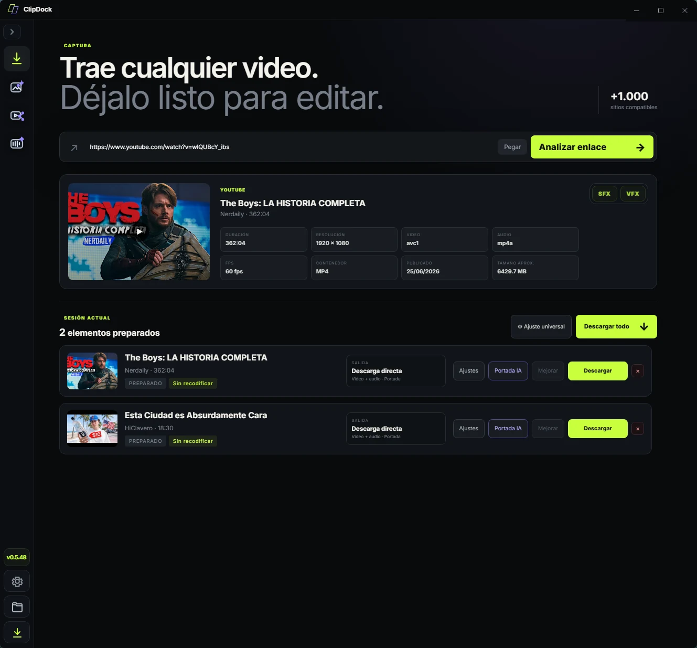
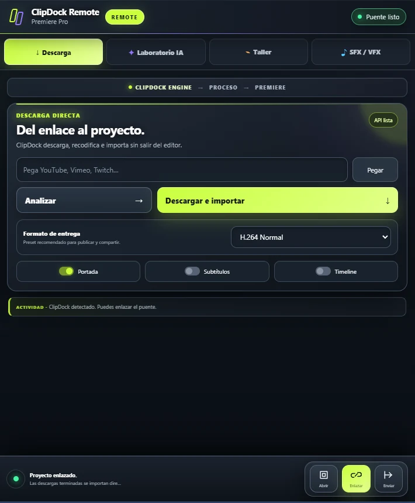
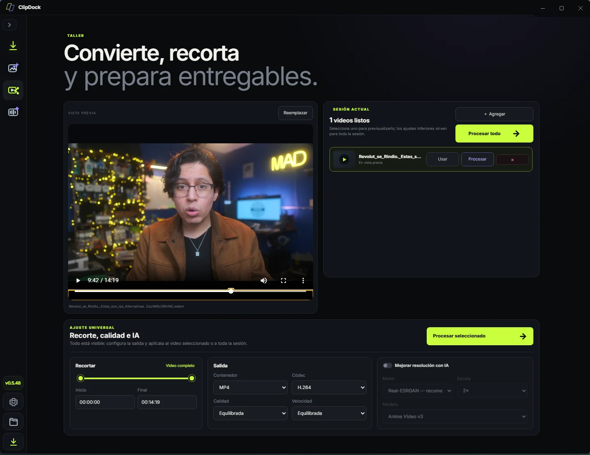
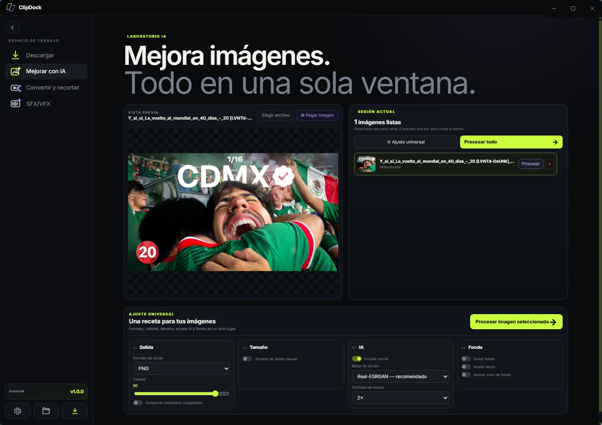
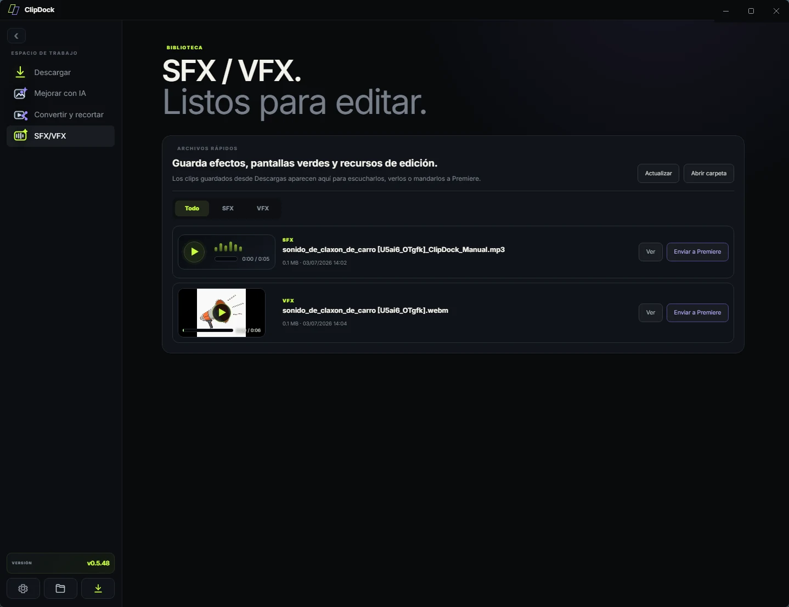
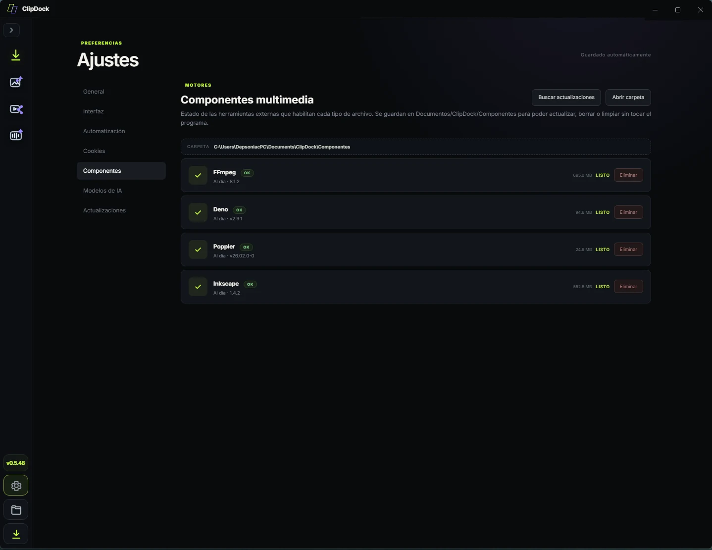
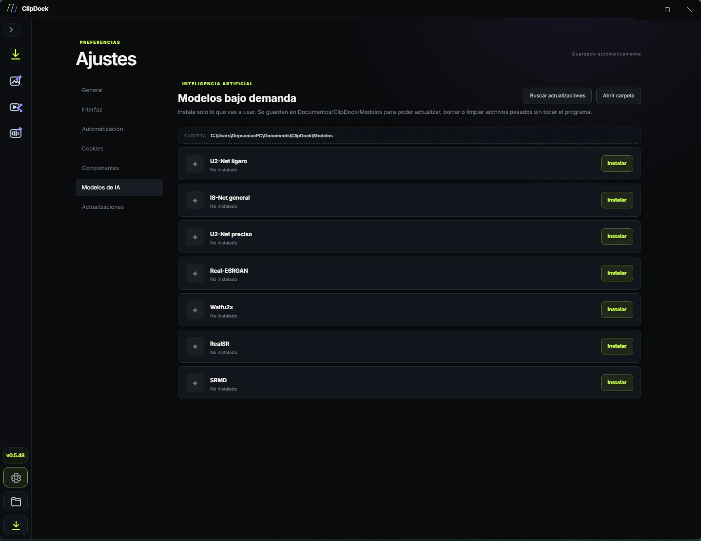

# ClipDock

**Del enlace al proyecto.**

ClipDock es una mesa de trabajo multimedia para descargar contenido desde fuentes compatibles, convertir, recortar, mejorar imágenes con IA local y enviar recursos directo a Adobe Premiere Pro mediante **ClipDock Remote**.

> Pensado para editores: pegar enlace, preparar salida, procesar y llevar el resultado al proyecto sin brincar entre mil herramientas.

## Qué hace

- **Descarga desde fuentes compatibles** usando una cola de sesión clara.
- **Analiza enlaces** y muestra metadatos como duración, resolución, formato, fecha y tamaño aproximado.
- **Descarga directa sin recodificar** cuando el formato disponible ya sirve para editar o entregar.
- **Convierte y recorta video** con presets de salida, contenedor, códec, calidad y velocidad.
- **Mejora imágenes con IA local**: escalado, eliminación de fondo, lienzo, formato de salida y calidad.
- **Organiza SFX/VFX** para ver, escuchar o mandar recursos a Premiere.
- **Administra componentes externos** como FFmpeg, Poppler, Inkscape y Deno desde una carpeta organizada.
- **Instala modelos de IA bajo demanda** para no cargar el programa con archivos pesados que no usas.
- **Control desde Premiere Pro** con ClipDock Remote.

## ClipDock Remote para Premiere Pro

ClipDock Remote es la extensión de Premiere Pro que conecta el editor con ClipDock Engine.

Permite:

- Pegar enlaces y descargar/importar directo al proyecto.
- Procesar imágenes seleccionadas con IA.
- Recodificar clips usando presets del motor de escritorio.
- Importar recursos guardados de la biblioteca SFX/VFX.
- Mantener un puente visible con estado de conexión.

## Capturas

### Taller: convertir y recortar

### Laboratorio IA

### Biblioteca SFX/VFX

### Componentes y modelos

## Flujo de trabajo

1. **Captura**: pega un enlace compatible o selecciona un archivo.
2. **Prepara**: elige descarga directa, conversión, recorte o proceso IA.
3. **Procesa**: ClipDock ejecuta la tarea con los motores instalados.
4. **Entrega**: guarda el archivo o mándalo a Premiere con ClipDock Remote.

## Repositorio

- Código: https://github.com/depsoniac/ClipDock
- Releases: https://github.com/depsoniac/ClipDock/releases
- Página visual: carpeta `docs/`.

## Requisitos técnicos

ClipDock puede usar herramientas externas según la función:

- FFmpeg para video/audio.
- yt-dlp para fuentes compatibles.
- Poppler/Inkscape para utilidades multimedia.
- Modelos locales para escalado y eliminación de fondos.
- Adobe Premiere Pro para usar ClipDock Remote.

## Uso responsable

ClipDock debe usarse con contenido propio, con permiso, de dominio público o con licencias que permitan descarga/procesamiento. La compatibilidad técnica con una fuente no significa que el contenido sea libre de derechos.

## Estado

Proyecto en desarrollo activo. La interfaz y los módulos pueden cambiar entre versiones.
